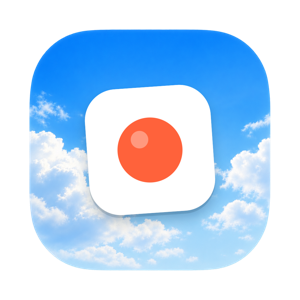
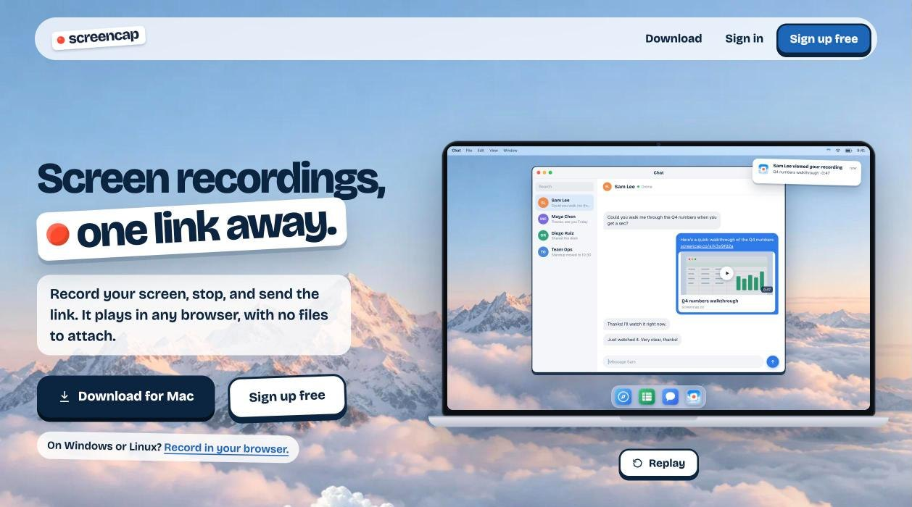
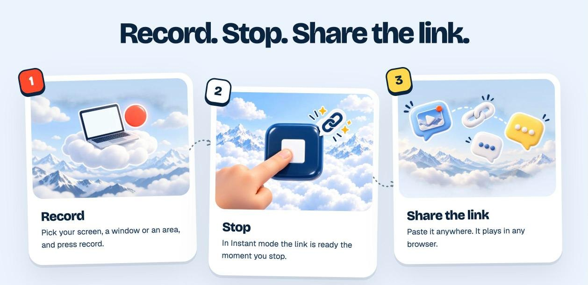
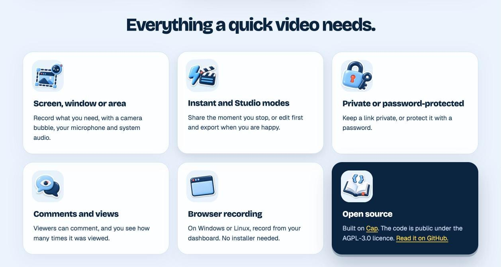

<p align="center">
	
</p>

<h1 align="center">Screencap</h1>

<p align="center">
	Screen recordings, one link away. Record your screen, stop, and send the link. It plays in any browser.
</p>

<p align="center">
	<a href="https://screencap.co">Website</a>
	 |
	<a href="https://screencap.co/download">Download for Mac</a>
	 |
	<a href="SCREENCAP.md#build-it-yourself">Build it yourself</a>
	 |
	<a href="SCREENCAP.md">What we changed</a>
</p>



Screencap is a free screen recorder with instant share links, run at [screencap.co](https://screencap.co)
by Dharma Loop LLC. It is an open-source fork of [Cap](https://github.com/CapSoftware/Cap), and this
repository is the exact code behind the hosted service and the Mac app.

## Features

- **Record, stop, share.** Capture a screen, a window or an area, with a camera bubble, your microphone and system audio.
- **Instant Mode.** The recording uploads while you record, so the link is ready the moment you stop.
- **Studio Mode.** Record locally, edit with backgrounds, zooms and trims, then export or share.
- **Transcripts, titles and summaries.** Bring your own [OpenRouter](https://openrouter.ai) key and pick the models; prices are shown per hour of video. Titles are drafted while you are still recording.
- **Comments and views.** Viewers can comment and react, and you see how many times a recording was watched.
- **Private or password-protected links.**
- **Browser recording** on Windows and Linux, straight from the dashboard.
- **Free.** No plans, no seats, no upgrade prompts.



## Get started

1. Download the Mac app from [screencap.co/download](https://screencap.co/download) (Apple Silicon or Intel), or record in your browser on Windows and Linux.
2. Sign up at [screencap.co](https://screencap.co).
3. Record, stop, and paste the link anywhere.

Prefer not to trust our download? [Build the Mac app yourself](SCREENCAP.md#build-it-yourself) from this
repository; it still signs in to screencap.co.



## Local Development

Screencap is a Turborepo monorepo with Rust, TypeScript, Tauri, SolidStart, Next.js, Drizzle, MySQL, Tailwind CSS, and shared media crates.

Requirements:

- Node.js 20 or newer
- Bun 1.4.0
- Rust 1.88 or newer
- Docker for MySQL, MinIO, and local services

Install and set up the repo:

```bash
bun install
bun run env-setup
bun run cap-setup
```

Common commands:

| Command | Purpose |
| --- | --- |
| `bun run dev` | Start the full local development stack |
| `bun run dev:web` | Start the web app without the desktop app |
| `bun run dev:desktop` | Start the desktop app |
| `bun run build` | Build the workspace |
| `bun run tauri:build` | Build the desktop release |
| `bun run lint` | Run Biome linting |
| `bun run format` | Format with Biome |
| `bun run typecheck` | Run TypeScript project references |
| `cargo test -p <crate>` | Run Rust tests for a crate |

Database commands:

| Command | Purpose |
| --- | --- |
| `bun run db:generate` | Generate database artifacts |
| `bun run db:push` | Push schema changes |
| `bun run db:studio` | Open Drizzle Studio |

## Repository Map

| Path | What lives there |
| --- | --- |
| `apps/desktop` | Tauri v2 desktop app with SolidStart UI and Rust backend |
| `apps/web` | Next.js web app for marketing, docs, dashboard, sharing, API routes, and auth |
| `apps/cli` | Rust CLI |
| `apps/media-server` | Media processing service used by the web app |
| `packages/database` | Drizzle schema and database access |
| `packages/ui` | Shared React UI |
| `packages/ui-solid` | Shared Solid UI |
| `packages/web-backend` | Backend service layer |
| `packages/web-domain` | Web domain models and types |
| `packages/env` | Environment validation |
| `packages/sdk-embed` | Embed SDK |
| `packages/sdk-recorder` | Recorder SDK |
| `crates/*` | Recording, capture, camera, audio, encoding, rendering, muxing, export, and test crates |
| `scripts/*` | Setup, analytics, build, and maintenance tooling |
| `infra/*` | Infrastructure configuration |

The web API uses Effect and `@effect/platform` HTTP APIs. Desktop capture and export paths are backed by Rust crates for fast recording, rendering, and platform-specific media access.

## License

- Code in the `cap-camera*` and `scap-*` crate families is licensed under the MIT License. See [licenses/LICENSE-MIT](licenses/LICENSE-MIT).
- Fonts are under the SIL Open Font License; see [licenses/fonts](licenses/fonts). Other bundled assets are listed in [ASSETS.md](ASSETS.md).
- Third-party components are licensed under the original license provided by their owner.
- Everything else is available under the AGPLv3 license as defined in [LICENSE](LICENSE).

## Credits

Screencap is built on [Cap](https://github.com/CapSoftware/Cap) by Cap Software and its contributors.
The changes we made are listed in [SCREENCAP.md](SCREENCAP.md).
